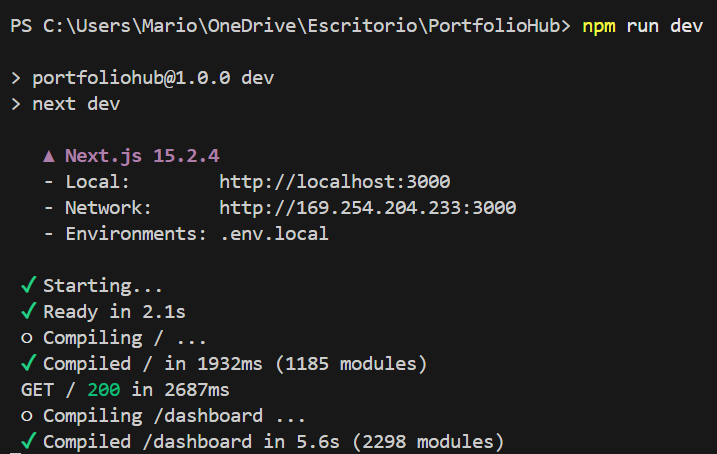

# PortfolioHub - Tu Dashboard de GitHub

---

## 📋 Tabla de Contenidos
- [Descripción del Proyecto](#-descripción-del-proyecto)
- [Características y Funcionalidades](#-características-y-funcionalidades)
- [Tecnologías Utilizadas](#-tecnologías-utilizadas)
- [Requisitos del Sistema](#-requisitos-del-sistema)
- [Instalación y Configuración](#-instalación-y-configuración)
- [Estructura del Proyecto](#-estructura-del-proyecto)
- [Próximas Funcionalidades](#-próximas-funcionalidades)
- [Licencia](#-licencia)
---

## 🚀 Descripción del Proyecto
PortfolioHub es una aplicación web moderna construida con Next.js que permite a los desarrolladores crear un portfolio personalizado utilizando datos de su cuenta de GitHub. La aplicación requiere un token de acceso personal de GitHub para obtener información detallada del usuario y presentarla en un dashboard visualmente atractivo con estadísticas, gráficos y elementos interactivos.
---
## 🎥 Demo

---
## ✨ Características y Funcionalidades

### 📊 Dashboard de Estadísticas
- **Perfil del usuario:** Información básica del usuario de GitHub  (logo, usuario y biografia)
- **Estadísticas de perfil:** las estrellas totales, los forks totales, los repositorios totales, asi como las estrellas promedio de cada repo, los commits totales y los lenguajes totales usados.
- **Gráficos de lenguajes:** Visualización de los lenguajes de programación utilizados  en formato de grafico de queso
- **Calendario de contribuciones:** Mapa de calor de commits y actividad  
- **Iconos de lenguajes:** Muestra los logos de los lenguajes de programacion usados.  
- **Estadísticas avanzadas:** Métricas detalladas de repositorios y actividad  

### 🎨 Componentes Interactivos
- **Temas personalizables:** Interfaz con modo claro y oscuro (ThemeSwitch)  
- **Exportación a PDF:** Generación del portfolio  en PDF para descargar y compartir.
- **Compartición via QR:** Generación de código QR para compartir el portfolio fácilmente
- **Planetas rotatorios:** Esta funcionalidad extra esta disponible en el codigo para mayor personalizacion, pero esta desactivada para la Demo para una mayor claridad.  
- **Filtros de repositorios:** Búsqueda y filtrado de repositorios por lenguaje o por estrellas  
- **Editor de código en vivo:** Posibilidad de personalizar y ejecutar secciones de código  
---

## 🛠 Tecnologías Utilizadas

### Frontend
- **Next.js 13+:** Framework React con renderizado híbrido (SSG/SSR)  
- **React 18+:** Biblioteca principal de interfaz de usuario  
- **Tailwind CSS:** Framework de CSS utility-first para estilos  
- **Context API:** Gestión del estado global de la aplicación  

### APIs y Servicios
- **GitHub REST API:** Obtención de datos de usuario y repositorios  
- **GitHub GraphQL API:** Consultas específicas para datos detallados  

### Utilidades y Librerías
- **React Loadable:** Carga *lazy* de componentes  
- **QR Code Generation:** Generación de códigos QR para compartir  
- **PDF Generation:** Creación de documentos PDF para exportación  
- **Chart Libraries:** Visualización de datos en gráficos  

---

## 📋 Requisitos del Sistema

### Requisitos Mínimos
- Node.js 16.8.0 o superior  
- npm 7.0 o superior  
- Token de acceso personal de GitHub con los *scopes* adecuados  

### Scopes Requeridos del Token de GitHub
El token debe tener los siguientes permisos:

- `repo` (incluyendo todos los sub-permisos)  
- `read:user`  
- `user:email`  
- `project`  
- `read:project`  
- `workflow`  

---

## 💻 Instalación y Configuración

1. **Clonar el Repositorio**
   ```bash
   git clone https://github.com/marichu-kt/PortfolioHub
   cd portfoliohub
   ```

2. **Instalar Dependencias**
   ```bash
   npm install
   ```

3. **Obtener y Configurar el Token de GitHub**  
   To run the script, you **must create and configure a [`.env.local`](https://github.com/marichu-kt/PortfolioHub/blob/main/.env.local) file** in the root of the project with the content:
   ```env
   NEXT_PUBLIC_GITHUB_TOKEN=XXXXXXXXXXXXXXXXXXX
   ```
   
   Replace `XXXXXXXXXXXXXXXXXXX` with:
   - `GITHUB_TOKEN`: your personal access token from [GitHub Settings → Developer settings → Personal access tokens](https://github.com/settings/tokens)

> ⚠️ **Nota:** Recuerda que para usar **PortfolioHub** necesitas un token de acceso personal de GitHub con los permisos adecuados. **Nunca compartas tu token públicamente.**


4. **Ejecutar la Aplicación**
   ```bash
   npm run dev
   ```
   La aplicación estará disponible en [http://localhost:3000](http://localhost:3000)

   

6. **Construir para Producción**
   ```bash
   npm run build
   npm start
   ```

---

## 📁 Estructura del Proyecto
```text
portfoliohub/
├── public/                 # Archivos estáticos
│   ├── images/            # Imágenes generales
│   │   └── logo.png       # Logo de la aplicación
│   └── textures/          # Texturas para componentes
│       ├── earth.jpg
│       ├── jupiter.jpg
│       ├── mars.jpg
│       ├── moon.jpg
│       └── venus.jpg
├── src/
│   ├── components/        # Componentes de React
│   │   ├── Achievements.js
│   │   ├── AdvancedStats.js
│   │   ├── AnimatedSection.js
│   │   ├── GitHubCalendarS.js
│   │   ├── LanguageChart.js
│   │   ├── LiveCodeEditor.js
│   │   ├── LoginButton.js
│   │   ├── PdfExportButton.js
│   │   ├── QRShare.js
│   │   ├── RepoFilters.js
│   │   ├── RotatingPlanet.js
│   │   ├── Skills.js
│   │   └── ThemeSwitch.js
│   ├── context/           # Contextos de React
│   │   └── ThemeContext.js
│   ├── hooks/             # Custom Hooks
│   │   └── useAuth.js
│   ├── pages/             # Páginas de Next.js
│   │   ├── _app.js        # Componente principal de la app
│   │   ├── customize.js   # Página de personalización
│   │   ├── dashboard.js   # Dashboard principal
│   │   └── index.js       # Página de inicio
│   ├── services/          # Servicios y APIs
│   ├── styles/            # Estilos globales
│   │   └── globals.css
│   └── utils/             # Utilidades
│       └── languageicons.js
├── next.config.js         # Configuración de Next.js
├── tailwind.config.js     # Configuración de Tailwind CSS
├── postcss.config.js      # Configuración de PostCSS
├── package.json           # Dependencias y scripts
└── README.md              # Este archivo
```

---

## 🔮 Próximas Funcionalidades
- Plantillas predefinidas para diferentes estilos de portfolio  
- Análisis más detallado de commits y contribuciones  
- Sistema de plugins para funcionalidades extendidas
- More ideas comente here: [Discussions](https://github.com/marichu-kt/PortfolioHub/discussions)

---

## 📜 Licencia

This project is licensed under the [MIT License](LICENSE) — free to use, modify, and distribute.
