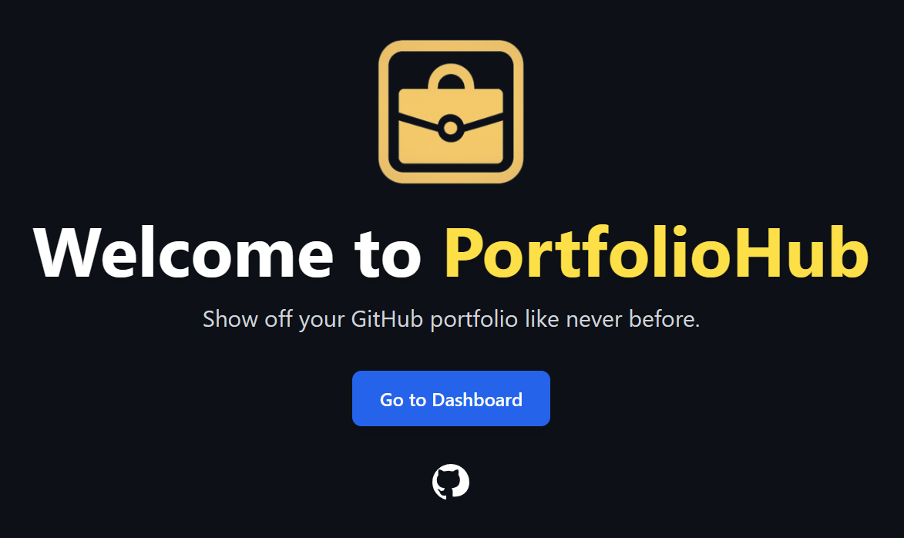

# PortfolioHub – Your Personal GitHub Dashboard 💼


## 📋 Table of Contents
- [Project Description](#-project-description)
- [Features and Functionality](#-features-and-functionality)
- [Technologies Used](#-technologies-used)
- [System Requirements](#-system-requirements)
- [Installation and Setup](#-installation-and-setup)
- [Project Structure](#-project-structure)
- [Upcoming Features](#-upcoming-features)
- [License](#-license)
---

## 🚀 Project Description
PortfolioHub is a modern web application built with Next.js that allows developers to create a personalized portfolio using data from their GitHub account. The application requires a personal GitHub access token to retrieve detailed user information and present it in a visually appealing dashboard with statistics, charts, and interactive elements.

---
## 🎥 Demo

---
## ✨ Features and Functionality

### 📊 Statistics Dashboard
- **User profile:** Basic GitHub user information (logo, username, and bio)  
- **Profile statistics:** total stars, total forks, total repositories, as well as the average stars per repo, total commits, and total languages used.  
- **Language charts:** Visualization of programming languages used in pie chart format  
- **Contribution calendar:** Heatmap of commits and activity  
- **Language icons:** Displays the logos of the programming languages used.  
- **Advanced statistics:** Detailed repository and activity metrics  

### 🎨 Interactive Components
- **Customizable themes:** Interface with light and dark mode (ThemeSwitch)  
- **PDF export:** Generate the portfolio in PDF format for download and sharing.  
- **QR sharing:** Generate QR code to easily share the portfolio  
- **Rotating planets:** This extra feature is available in the code for greater customization, but it is disabled in the Demo for clarity.  
- **Repository filters:** Search and filter repositories by language or stars  
- **Live code editor:** Ability to customize and run code sections  
---

## 🛠 Technologies Used

### Frontend
- **Next.js 13+:** React framework with hybrid rendering (SSG/SSR)  
- **React 18+:** Main UI library  
- **Tailwind CSS:** Utility-first CSS framework for styling  
- **Context API:** Global state management for the application  

### APIs and Services
- **GitHub REST API:** Retrieve user and repository data  
- **GitHub GraphQL API:** Specific queries for detailed data  

### Utilities and Libraries
- **React Loadable:** Lazy loading of components  
- **QR Code Generation:** Generate QR codes for sharing  
- **PDF Generation:** Create PDF documents for export  
- **Chart Libraries:** Data visualization in charts  

---

## 📋 System Requirements

### Minimum Requirements
- Node.js 16.8.0 or higher  
- npm 7.0 or higher  
- Personal GitHub access token with the appropriate *scopes*  

### Required GitHub Token Scopes
The token must have the following permissions:

- `repo` (including all sub-permissions)  
- `read:user`  
- `user:email`  
- `project`  
- `read:project`  
- `workflow`  

---

## 💻 Installation and Setup

1. **Clone the Repository**
   ```bash
   git clone https://github.com/marichu-kt/PortfolioHub
   cd portfoliohub
   ```

2. **Install Dependencies**
   ```bash
   npm install
   ```

3. **Get and Configure the GitHub Token**  
   To run the script, you **must create and configure a [`.env.local`](https://github.com/marichu-kt/PortfolioHub/blob/main/.env.local) file** in the root of the project with the content:
   ```env
   NEXT_PUBLIC_GITHUB_TOKEN=XXXXXXXXXXXXXXXXXXX
   ```
   
   Replace `XXXXXXXXXXXXXXXXXXX` with:
   - `GITHUB_TOKEN`: your personal access token from [GitHub Settings → Developer settings → Personal access tokens](https://github.com/settings/tokens)

4. **Run the Application**
   ```bash
   npm run dev
   ```
   The application will be available at [http://localhost:3000](http://localhost:3000)

   

6. **Build for Production**
   ```bash
   npm run build
   npm start
   ```

---

## 📁 Project Structure
```text
portfoliohub/
├── public/                 # Static files
│   ├── images/            # General images
│   │   └── logo.png       # Application logo
│   └── textures/          # Textures for components
│       ├── earth.jpg
│       ├── jupiter.jpg
│       ├── mars.jpg
│       ├── moon.jpg
│       └── venus.jpg
├── src/
│   ├── components/        # React components
│   │   ├── Achievements.js
│   │   ├── AdvancedStats.js
│   │   ├── AnimatedSection.js
│   │   ├── GitHubCalendarS.js
│   │   ├── LanguageChart.js
│   │   ├── LiveCodeEditor.js
│   │   ├── LoginButton.js
│   │   ├── PdfExportButton.js
│   │   ├── QRShare.js
│   │   ├── RepoFilters.js
│   │   ├── RotatingPlanet.js
│   │   ├── Skills.js
│   │   └── ThemeSwitch.js
│   ├── context/           # React contexts
│   │   └── ThemeContext.js
│   ├── hooks/             # Custom Hooks
│   │   └── useAuth.js
│   ├── pages/             # Next.js pages
│   │   ├── _app.js        # Main app component
│   │   ├── customize.js   # Customization page
│   │   ├── dashboard.js   # Main dashboard
│   │   └── index.js       # Home page
│   ├── services/          # Services and APIs
│   ├── styles/            # Global styles
│   │   └── globals.css
│   └── utils/             # Utilities
│       └── languageicons.js
├── next.config.js         # Next.js configuration
├── tailwind.config.js     # Tailwind CSS configuration
├── postcss.config.js      # PostCSS configuration
├── package.json           # Dependencies and scripts
└── README.md              # This file
```

---

## 🔮 Upcoming Features
- Predefined templates for different portfolio styles  
- More detailed commit and contribution analysis  
- Plugin system for extended features  
- More ideas comment here: [Discussions](https://github.com/marichu-kt/PortfolioHub/discussions)

---

## 🔖 Use of Author References for Planet Textures

To respect the **copyright and attributions of the images used (exclusively for the planet texture images)**, I have used the tool:

👉 [**SaferLayer**](https://saferlayer.com/)

This tool allows embedding the author reference or the intended activity into the images, ensuring proper credit attribution clearly within the website and preventing their removal with Artificial Intelligence.

---

## 📫 Contact

If you have questions or want to provide suggestions, you can write to me at:  
[marichu.private@proton.me](mailto:marichu.private@proton.me)

---

## 📄 License

This project is licensed under the **MIT License**. See the file [LICENSE](LICENSE) for more details.
